### EAS Basis Data Terdistribusi
## TiDb Cluster
### Alvin Tanuwijaya - 05111640000021

## Arsitektur TiDb
1. Gambar Arsitektur

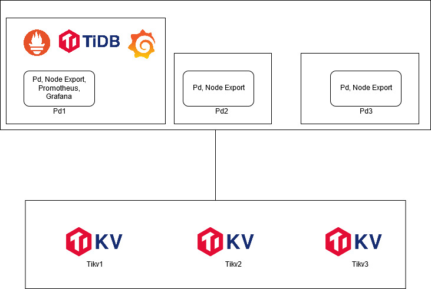

2. Penjelasan
Pada arsitektur yang digunakan, terdapat 6 server, yaitu:

|          |                     pd1                    |       pd2      |       pd3      |        tikv1       |        tikv2       |           tikv3              |
|:--------:|:---------------------------------------------:|:-----------------:|:-----------------:|:-------------------:|:-------------------:|---------------------|
| Plugin | PD, TiDB, node_export, Prometheus, Grafana | PD, node_export| PD, node_export| TiKV, node_export| TiKV, node_export| TiKV, node_export|
| OS       | CentOS 7                                      | CentOS 7          | CentOS 7          | CentOS 7            | CentOS 7            | CentOS 7            |
| RAM      | `512` MB                                      | `512` MB          | `512` MB          | `512` MB            | `512` MB            | `512` MB            |
| IP       | 192.168.16.21                                 | 192.168.16.22     | 192.168.16.23     | 192.168.16.24       | 192.168.16.25       | 192.168.16.26       |

### Implementasi pada Vagrant
1. Membuat Vagrantfile
Membuat vagrantfile dengan mengetikkan pada command prompt:
```bash
    vagrant init
```
2. Edit vagrantfile menjadi
```ruby
# -*- mode: ruby -*-
# vi: set ft=ruby :

Vagrant.configure("2") do |config|
    (1..3).each do |i|
      config.vm.define "pd#{i}" do |node|
        node.vm.hostname = "pd#{i}"

        # Gunakan CentOS 7 dari geerlingguy yang sudah dilengkapi VirtualBox Guest Addition
        node.vm.box = "geerlingguy/centos7"
        node.vm.box_version = "1.2.19"
        
        # Disable checking VirtualBox Guest Addition agar tidak compile ulang setiap restart
        node.vbguest.auto_update = false
        
        node.vm.network "private_network", ip: "192.168.199.#{20+i}"
        
        node.vm.provider "virtualbox" do |vb|
          vb.name = "pd#{i}"
          vb.gui = false
          vb.memory = "512"
        end
  
        node.vm.provision "shell", path: "provision/bootstrap.sh", privileged: false
      end
    end

    (1..3).each do |i|
      config.vm.define "tikv#{i}" do |node|
        node.vm.hostname = "tikv#{i}"

        # Gunakan CentOS 7 dari geerlingguy yang sudah dilengkapi VirtualBox Guest Addition
        node.vm.box = "geerlingguy/centos7"
        node.vm.box_version = "1.2.19"
        
        # Disable checking VirtualBox Guest Addition agar tidak compile ulang setiap restart
        node.vbguest.auto_update = false
        
        node.vm.network "private_network", ip: "192.168.199.#{23+i}"
        
        node.vm.provider "virtualbox" do |vb|
          vb.name = "tikv#{i}"
          vb.gui = false
          vb.memory = "512"
        end
  
        node.vm.provision "shell", path: "provision/bootstrap.sh", privileged: false
      end
    end
  end
```
3. Menginstall plugin vbguest dengan mengetikkan pada command prompt:
```bash
   vagrant plugin install vagrant-vbguest
```

4. Membuat script provision untuk dijalankan saat vagrant up:
```bash
# Referensi:
# https://pingcap.com/docs/stable/how-to/deploy/from-tarball/testing-environment/

# Update the repositories
# sudo yum update -y

# Copy open files limit configuration
sudo cp /vagrant/config/tidb.conf /etc/security/limits.d/

# Enable max open file
sudo sysctl -w fs.file-max=1000000

# Copy atau download TiDB binary dari http://download.pingcap.org/tidb-v3.0-linux-amd64.tar.gz
cp /vagrant/installer/tidb-v3.0-linux-amd64.tar.gz .

# Extract TiDB binary
tar -xzf tidb-v3.0-linux-amd64.tar.gz

# Install MariaDB to get MySQL client
sudo yum -y install mariadb

# Install Git
sudo yum -y install git

# Install nano text editor
sudo yum -y install nano

#Install node exporter
wget https://github.com/prometheus/node_exporter/releases/download/v0.15.2/node_exporter-0.15.2.linux-amd64.tar.gz

#extract node exporter
tar -xzf node_exporter-0.15.2.linux-amd64.tar.gz
```
5. Jalankan vagrant dengan mengetikkan :
```bash
    vagrant up
```
6. Konfigurasi TiDb:
- Pada pd1, masuk dengan `vagrant ssh pd1`, lalu ketikkan :
```bash
./bin/pd-server --name=pd1 \
                --data-dir=pd \
                --client-urls="http://192.168.16.21:2379" \
                --peer-urls="http://192.168.16.21:2380" \
                --initial-cluster="pd1=http://192.168.16.21:2380,pd2=http://192.168.16.22:2380,pd3=http://192.168.16.23:2380" \
                --log-file=pd.log &
```
- Pada pd2, masuk dengan `vagrant ssh pd2`, lalu ketikkan :
```bash
./bin/pd-server --name=pd2 \
                --data-dir=pd \
                --client-urls="http://192.168.16.22:2379" \
                --peer-urls="http://192.168.16.22:2380" \
                --initial-cluster="pd1=http://192.168.16.21:2380,pd2=http://192.168.16.22:2380,pd3=http://192.168.16.23:2380" \
                --log-file=pd.log &
```
- Pada pd3, masuk dengan `vagrant ssh pd3`, lalu ketikkan :
```bash
./bin/pd-server --name=pd3 \
                --data-dir=pd \
                --client-urls="http://192.168.16.23:2379" \
                --peer-urls="http://192.168.16.23:2380" \
                --initial-cluster="pd1=http://192.168.16.21:2380,pd2=http://192.168.16.22:2380,pd3=http://192.168.16.23:2380" \
                --log-file=pd.log &
```
- Pada tikv1, masuk dengan `vagrant ssh tikv1`, lalu ketikkan::
```bash
./bin/tikv-server --pd="192.168.16.21:2379,192.168.16.22:2379.192.168.16.23:2379" \
                  --addr="192.168.16.24:20160" \
                  --data-dir=tikv \
                  --log-file=tikv.log &
```
- Pada tikv2, masuk dengan `vagrant ssh tikv2`, lalu ketikkan::
```bash
./bin/tikv-server --pd="192.168.16.21:2379,192.168.16.22:2379.192.168.16.23:2379" \
                  --addr="192.168.16.25:20160" \
                  --data-dir=tikv \
                  --log-file=tikv.log &
```
- Pada tikv3, masuk dengan `vagrant ssh tikv3`, lalu ketikkan::
```bash
./bin/tikv-server --pd="192.168.16.21:2379,192.168.16.22:2379.192.168.16.23:2379" \
                  --addr="192.168.16.26:20160" \
                  --data-dir=tikv \
                  --log-file=tikv.log &
```
- Kembali pada pd1, masuk dengan `vagrant ssh pd1`, lalu ketikkan :
```bash
./bin/tidb-server --store=tikv \
                  --path="192.168.16.21:2379" \
                  --log-file=tidb.log &
```

## Aplikasi CRUD
Aplikasi yang digunakan menggunakan aplikasi dengan format dataset seperti pada tugas MongoDb yaitu tentang UFO Sightings dan aplikasi dibuat menggunakan Python dan Flask.

### Create
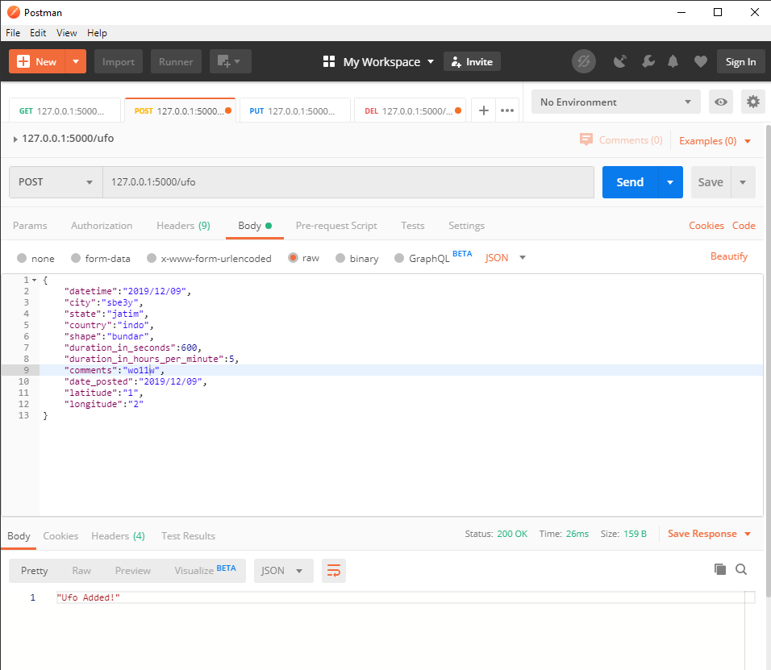
### Read
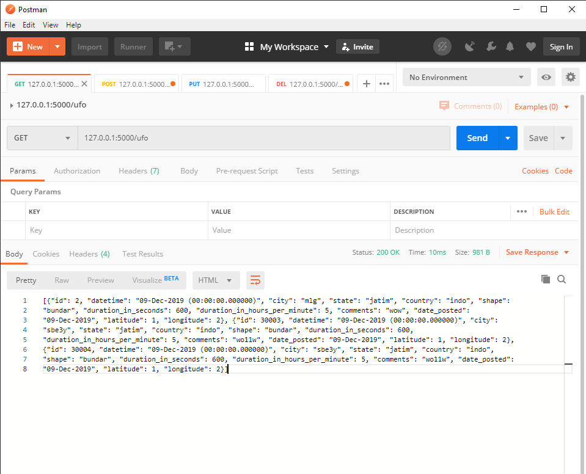
### Update
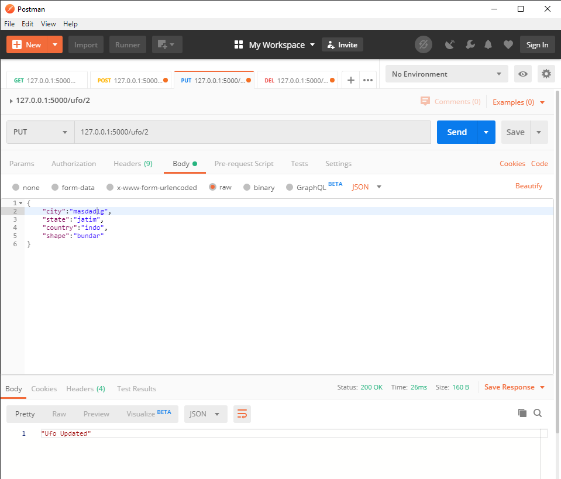
### Delete
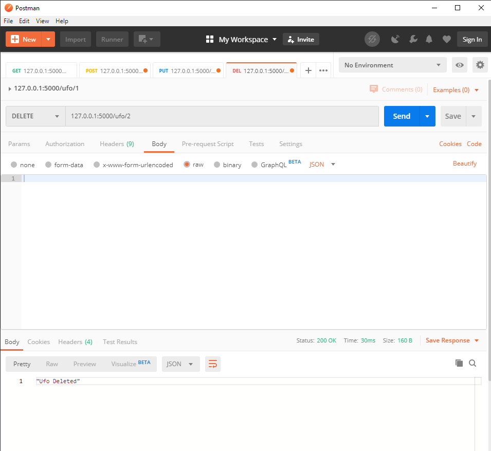

Dengan hasil akhir 
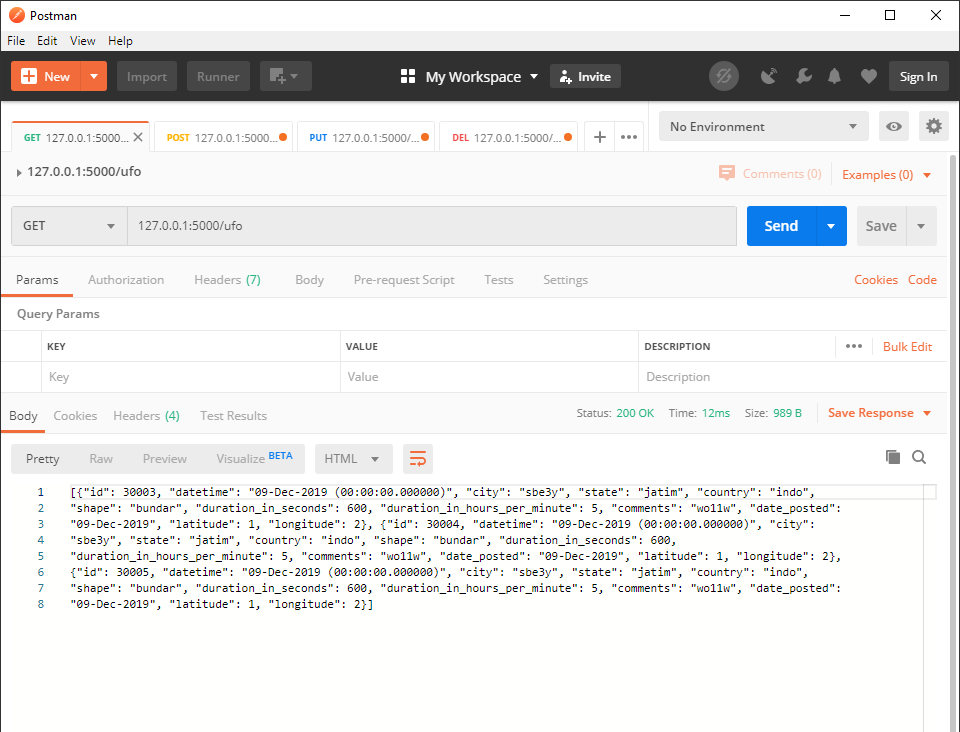
## Uji Performa

### Pengujian JMeter
- 100 user
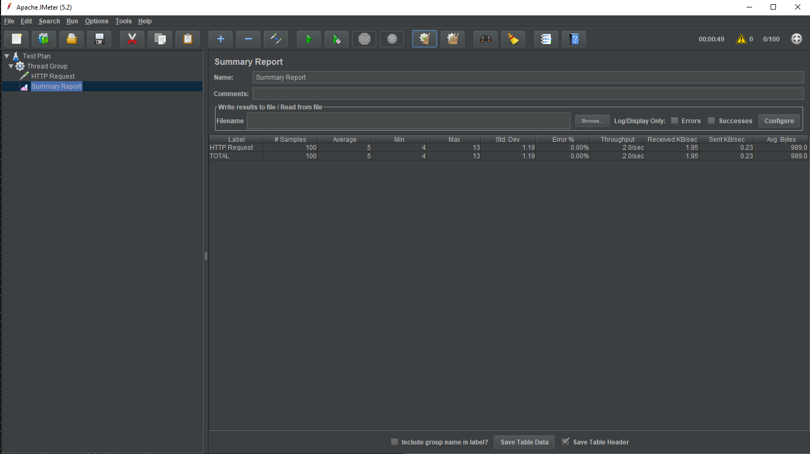
- 500 user
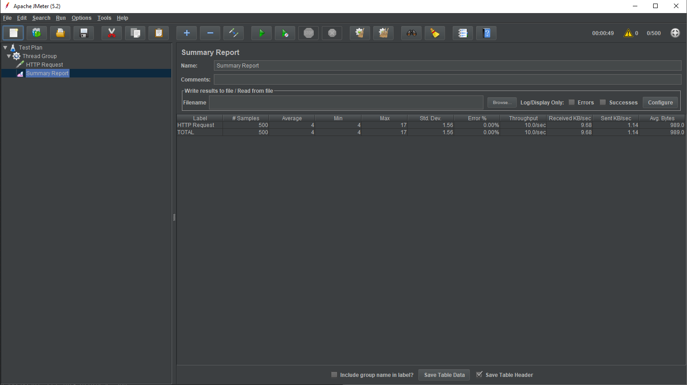
- 1000 user
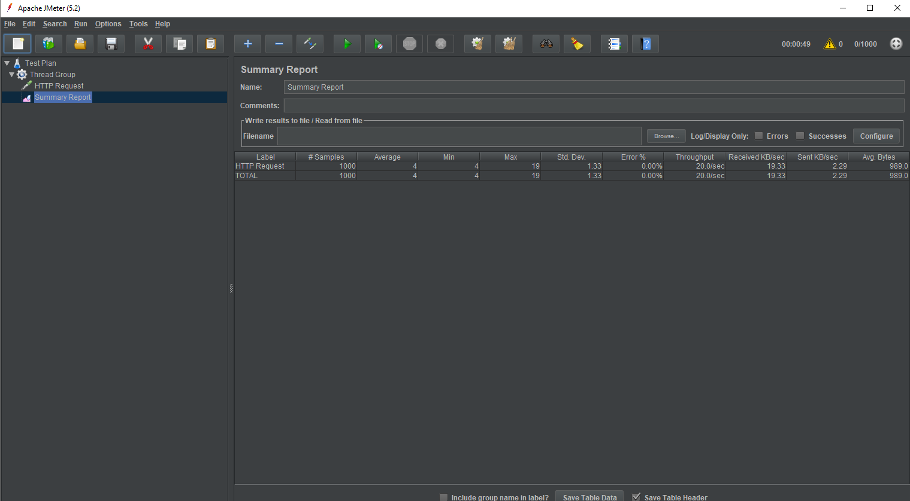
## Pengujian Sysbench
### Install Sysbench
- Masuk ke pd1 dan ketikkan:
```
curl -s https://packagecloud.io/install/repositories/akopytov/sysbench/script.rpm.sh | sudo bash    
    sudo yum -y install sysbench
```
- Lalu clone repo tidb bench :
```
git clone https://github.com/pingcap/tidb-bench.git
    cd tidb-bench/sysbench
```
 ### Pengujian
- Edit file config dengan `nano config` lalu edit agar mysql sesuai dengan database yang digunakan
- Melakukan persiapan dengan `./run.sh point_select prepare 100` 
- Melakukan run dengan `./run.sh point_select run 100` 
 ### Hasil Uji
 Hasil pengujian dengan sysbench pada:
 - 3 Pd Menyala
 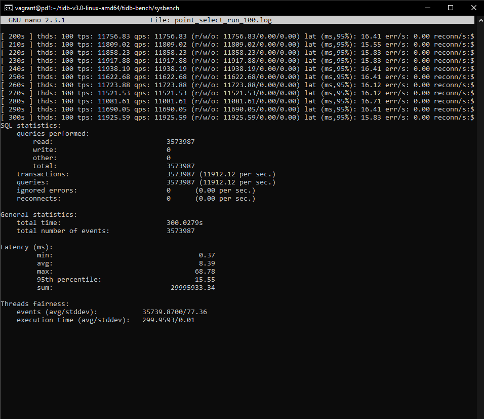
 - 2 Pd Menyala
 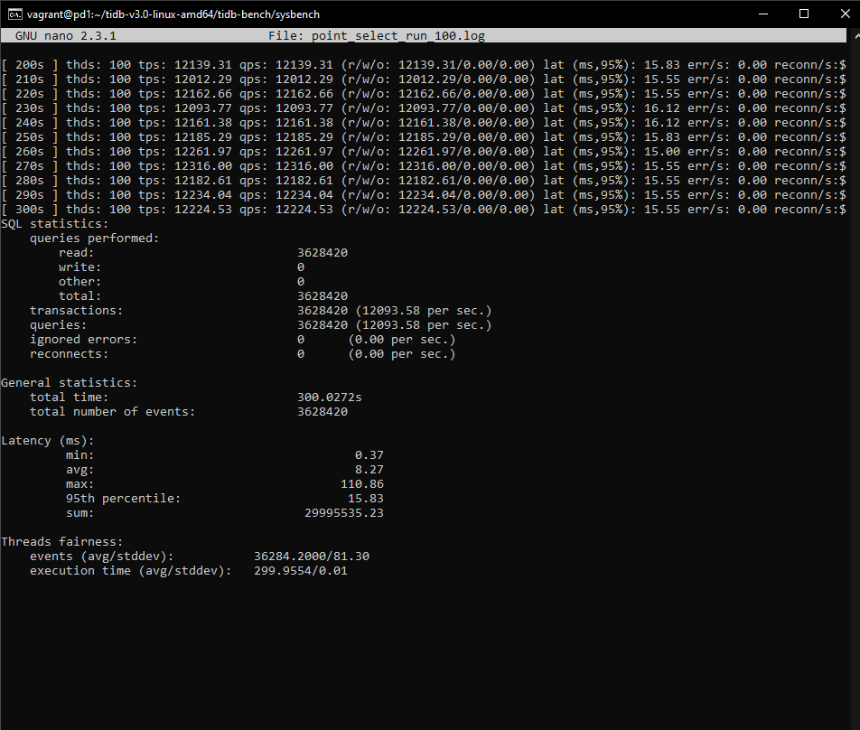
 Pengujian tidak dapat dilakukan apabila hanya 1 Pd yang menyala karena server terus mencari server lain dalam cluster.

 Kesimpulan: \
 Performa meningkat dengan jumlah Pd yang meningkat.

### Uji Fail Over
1. Lihat leader yang sedang menyala dengan mengetikkan pada node manapun 
 ```
    curl http://192.168.16.21:2379/pd/api/v1/members
```
 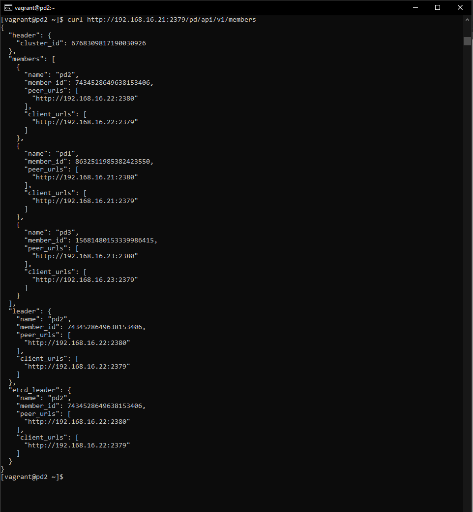
2. Masuk ke Pd2 (karena Pd2 Leader) dan kill pd:
```
   ps -aux | grep pd
```
Kill pid pd-server :
```
   sudo kil -9 <pid>
```
3. Cek apakah leader berganti :
 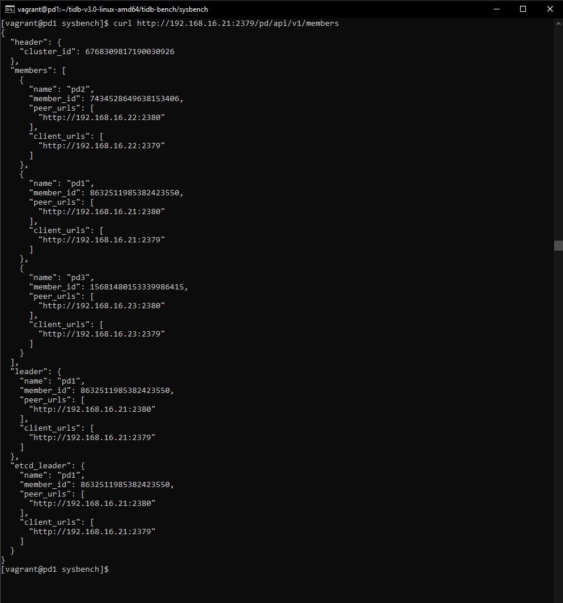
## Monitoring dengan Grafana
### Install Node Exporter, Prometheus, Grafana
- Masuk ke setiap node dan ketikkan :
```bash
    cd node_exporter-0.18.1.linux-amd64
    ./node_exporter --web.listen-address=":9100" \
        --log.level="info" &
```
- Setelah semua node dilakukan, kembali ke node 1 dan lakukan perintah untuk download prometheus dan grafana :
```bash
    wget https://github.com/prometheus/prometheus/releases/download/v2.2.1/prometheus-2.2.1.linux-amd64.tar.gz
    wget https://dl.grafana.com/oss/release/grafana-6.5.1.linux-amd64.tar.gz

    tar -xzf prometheus-2.2.1.linux-amd64.tar.gz
    tar -zxf grafana-6.5.1.linux-amd64.tar.gz
```
- Edit prometheus.yml menjadi :
```
global:
  scrape_interval:     15s  # By default, scrape targets every 15 seconds.
  evaluation_interval: 15s  # By default, scrape targets every 15 seconds.
  # scrape_timeout is set to the global default value (10s).
  external_labels:
    cluster: 'test-cluster'
    monitor: "prometheus"

scrape_configs:
  - job_name: 'overwritten-nodes'
    honor_labels: true  # Do not overwrite job & instance labels.
    static_configs:
    - targets:
      - '192.168.16.21:9100'
      - '192.168.16.22:9100'
      - '192.168.16.23:9100'
      - '192.168.16.24:9100'
      - '192.168.16.25:9100'
      - '192.168.16.26:9100'

  - job_name: 'tidb'
    honor_labels: true  # Do not overwrite job & instance labels.
    static_configs:
    - targets:
      - '192.168.16.21:10080'

  - job_name: 'pd'
    honor_labels: true  # Do not overwrite job & instance labels.
    static_configs:
    - targets:
      - '192.168.16.21:2379'
      - '192.168.16.22:2379'
      - '192.168.16.23:2379'

  - job_name: 'tikv'
    honor_labels: true  # Do not overwrite job & instance labels.
    static_configs:
    - targets:
      - '192.168.16.24:20180'
      - '192.168.16.25:20180'
      - '192.168.16.26:20180'
```
- Jalankan prometheus dengan 
```
cd ~
cd prometheus-2.2.1.linux-amd64
./prometheus \
    --config.file="./prometheus.yml" \
    --web.listen-address=":9090" \
    --web.external-url="http://192.168.16.21:9090/" \
    --web.enable-admin-api \
    --log.level="info" \
    --storage.tsdb.path="./data.metrics" \
    --storage.tsdb.retention="15d" &
```
Tambahkan `grafana.ini` dengan :
```bash
    cd .. && cd grafana-6.5.1
    nano conf/grafana.ini
    ```
    ```ini
    [paths]
    data = ./data
    logs = ./data/log
    plugins = ./data/plugins
    [server]
    http_port = 3000
    domain = 192.168.16.21
    [database]
    [session]
    [analytics]
    check_for_updates = true
    [security]
    admin_user = admin
    admin_password = admin
    [snapshots]
    [users]
    [auth.anonymous]
    [auth.basic]
    [auth.ldap]
    [smtp]
    [emails]
    [log]
    mode = file
    [log.console]
    [log.file]
    level = info
    format = text
    [log.syslog]
    [event_publisher]
    [dashboards.json]
    enabled = false
    path = ./data/dashboards
    [metrics]
    [grafana_net]
    url = https://grafana.net
```
- Jalankan grafana
```bash
    ./bin/grafana-server \
        --config="./conf/grafana.ini" &
```

### Konfigurasi Grafana
1. Masuk ke grafana dengan membuka browser pada `192.168.16.21:3000` dan user `admin` dan password `admin`
2. Pada bagian data source, add source promotheus dengan url `http://192.168.16.21' dan port 9090
3. Import dashboard grafana dari [link](https://github.com/pingcap/tidb-ansible/tree/master/scripts) pada bagian import dan add json file dari link diatas.

Saya menggunakan dahsboard `tidb.json`, `tidb_summary.json`, `tikv_summary.json`

- tidb.json
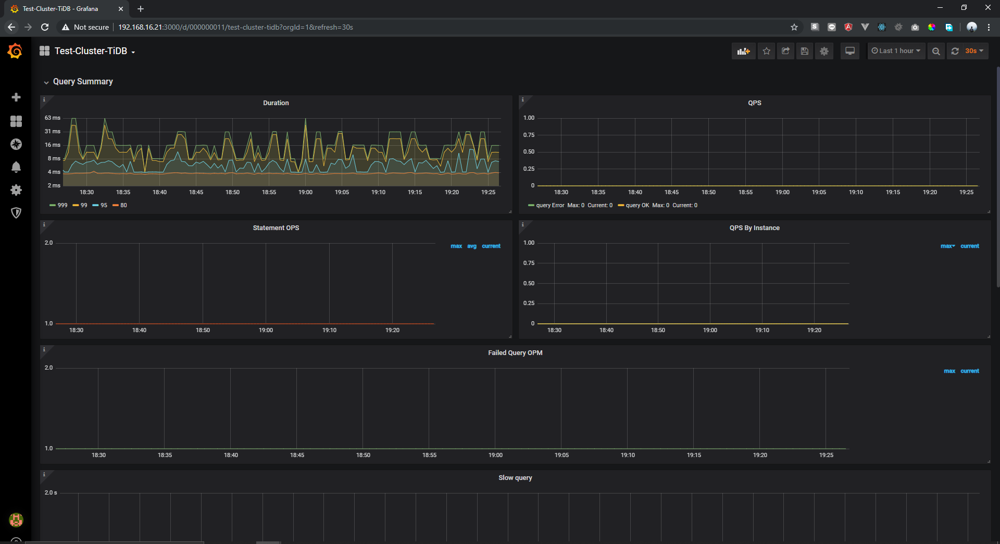
- tidb_summary.json
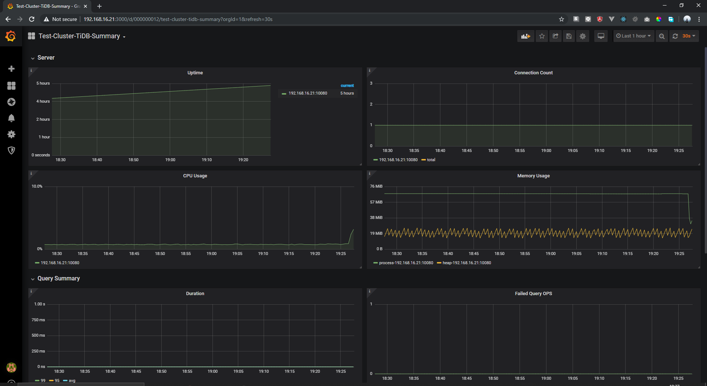
- tikv_summary.json
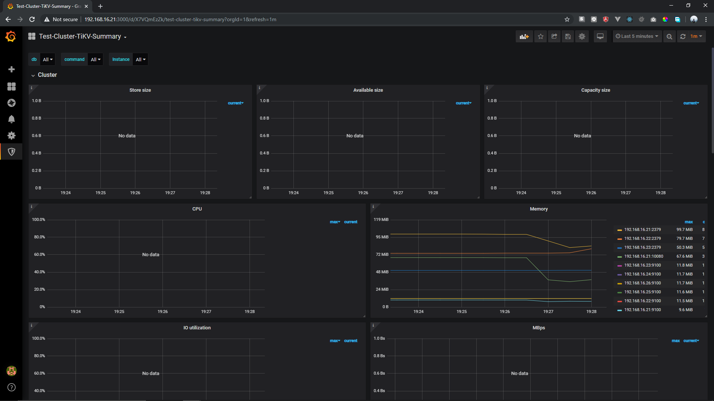